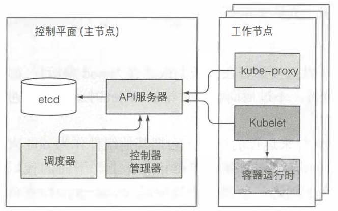
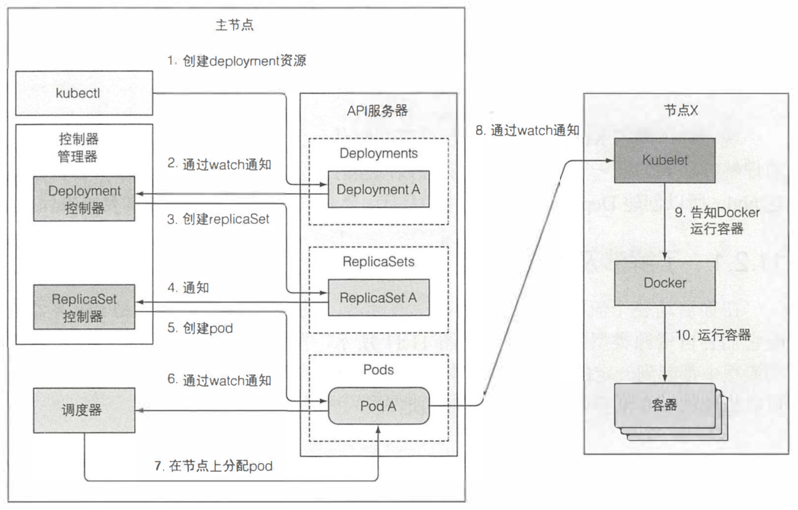

###控制平面的组件功能
- API服务器：存储资源到etcd和通知客户端有变更
- 调度器：给pod分配节点
- 控制器：确保系统真实状态朝API服务器定义的期望状态收敛

k8s控制平面及工作节点的组件

### 控制器如何协作

在启动整个流程之前，控制器、调度器、kubelet就已经通过API服务器监听它们各自资源类型的变化了。以Deployment资源提交到API服务器的事件链为例：

将包含Deployment清单的YAML文件，通过kubectl提交到K8S, kubectl通过HTTP POST请求发送到k8s API服务器。API服务器检查Deployment定义，存储到etcd，返回相应给kubectl。

