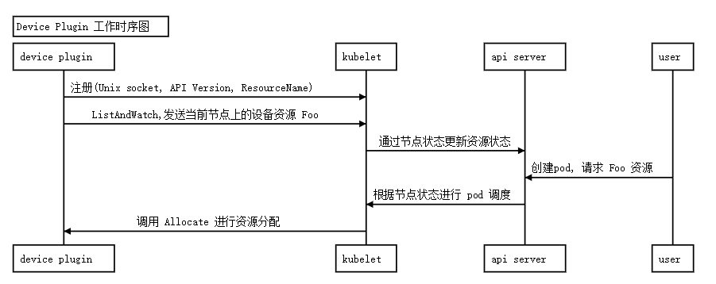

### device plugin 的实现方案

device plugin 的工作原理其实不复杂。主要有以下步骤：

* 首先 device plugin 可以通过手动或 daemonset 部署到需要的节点上。
* 为了让 Kubernetes 发现 device plugin，需要向 kubelet 的 unix socket。 进行注册，注册的信息包括 device plugin 的 unix socket，API Version，ResourceName。
* kubelet 通过 grpc 向 device plugin 调用 ListAndWatch， 获取当前节点上的资源。
* kubelet 向 api server 更新节点状态来通知资源变更。
* 用户创建 pod，请求资源并调度到节点上后，kubelet 调用 device plugin 的 Allocate 进行资源分配。

#### 实现device plugin的时序图



### ListAndWatch

我们定义的 myway5.com/cola 资源用 /etc/colas 下的文件代表。每一个文件代表一个可用的资源。因此实现 ListAndWatch 就是查找该文件夹下的文件，然后添加到设备列表发送给 kubelet，之后调用 fsnotify 去监控文件的 CREATE 和 REMOVE 事件。每次设备列表发生变更都重新向 kubelet 发送更新过的设备列表.

```chef
// ListAndWatch returns a stream of List of Devices
// Whenever a Device state change or a Device disappears, ListAndWatch
// returns the new list
func (s *ColaServer) ListAndWatch(e *pluginapi.Empty, srv pluginapi.DevicePlugin_ListAndWatchServer) error {
    log.Infoln("ListAndWatch called")
    devs := make([]*pluginapi.Device, len(s.devices))

    i := 0
    for _, dev := range s.devices {
        devs[i] = dev
        i++
    }

    err := srv.Send(&pluginapi.ListAndWatchResponse{Devices: devs})
    if err != nil {
        log.Errorf("ListAndWatch send device error: %v", err)
        return err
    }

    // 更新 device list
    for {
        log.Infoln("waiting for device change")
        select {
        case <-s.notify:
            log.Infoln("开始更新device list, 设备数:", len(s.devices))
            devs := make([]*pluginapi.Device, len(s.devices))

            i := 0
            for _, dev := range s.devices {
                devs[i] = dev
                i++
            }

            srv.Send(&pluginapi.ListAndWatchResponse{Devices: devs})
        }
    }
}
```

### Allocate

在用户创建的 Pod 请求资源时，Kubernetes 的调度器会进行调度，并通过 kubelet 向 device plugin 发出 Allocate 调用，这一步的调用主要是为了让 device plugin 为容器调度资源。 在调度成功后向 kubelet 返回调度结果即可。

```
// Allocate is called during container creation so that the Device
// Plugin can run device specific operations and instruct Kubelet
// of the steps to make the Device available in the container
func (s *ColaServer) Allocate(ctx context.Context, reqs *pluginapi.AllocateRequest) (*pluginapi.AllocateResponse, error) {
    log.Infoln("Allocate called")
    resps := &pluginapi.AllocateResponse{}
    for _, req := range reqs.ContainerRequests {
        log.Infof("received request: %v", strings.Join(req.DevicesIDs, ","))
        resp := pluginapi.ContainerAllocateResponse{
            Envs: map[string]string{
                "COLA_DEVICES": strings.Join(req.DevicesIDs, ","),
            },
        }
        resps.ContainerResponses = append(resps.ContainerResponses, &resp)
    }
    return resps, nil
}
```

### 部署

device plugin 可以手动部署到机器上，也可以通过 Daemonset 进行部署。这里当然是 Daemonset 进行部署了。部署的时候有几个注意事项：

* 需要挂载 hostPath，其中 /var/lib/kubelet/device-plugins 是必须的。这个文件夹下有 kubelet.sock，以及我们也需要将 device plugin 的 unix socket 文件存在这里。使得 kubelet 可以和我们的应用通信。
* 为 device plugin 的 Pod 设置调度优先级别，通常设置成 priorityClassName: "system-node-critical"。这样可以保证不会因为节点利用率过高被逐出。
* 如果资源设备不是每台机器都有，建议使用 nodeSelector 将 device plugin 调度到指定的机器上。

### 参考

[文档](https://www.myway5.com/index.php/2020/03/24/kubernetes%E5%BC%80%E5%8F%91%E7%9F%A5%E8%AF%86-device-plugin%E7%9A%84%E5%AE%9E%E7%8E%B0/)

[代码](https://github.com/joyme123/cola-device-plugin)
