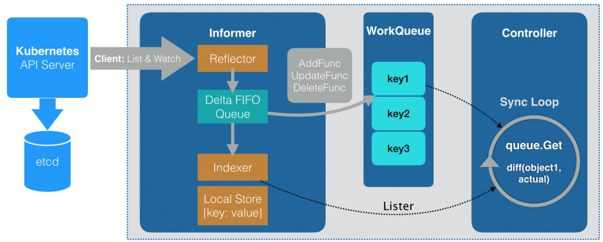

在kubernetes系统中，组件之间通过HTTP协议进行通信，如何在不依赖任何中间件的情况下需要保证消息的实时性、可靠性、顺序性等？答案就是Informer机制。Kubernetes的其他组件都是通过client-go的informer机制与kubernetes API Server进行通信的。

在正常情况下，k8s的其他组件在使用informer机制时出发资源事件回调方法，将资源对象推送到WorkQueue或其他队列中，在demo1代码中，我们直接输出触发的资源事件。最后通过informer.Run函数运行当前的informer，内部为pod资源类型创建informer。

通过informer机制可以很容易监控我们所关心的资源事件。如，当监控k8s pod资源时，如果Pod资源发生了added, updated, deleted事件，就通知client-go，告知k8s资源事件变更了并且需要进行相应的处理。