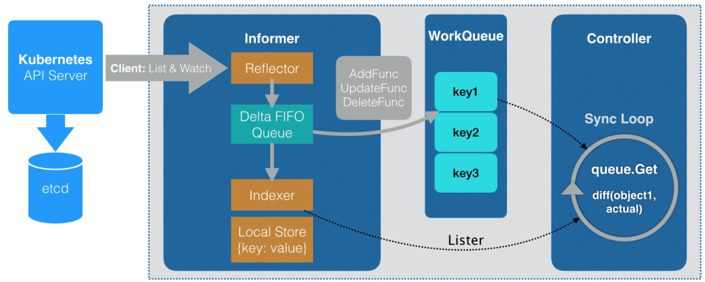
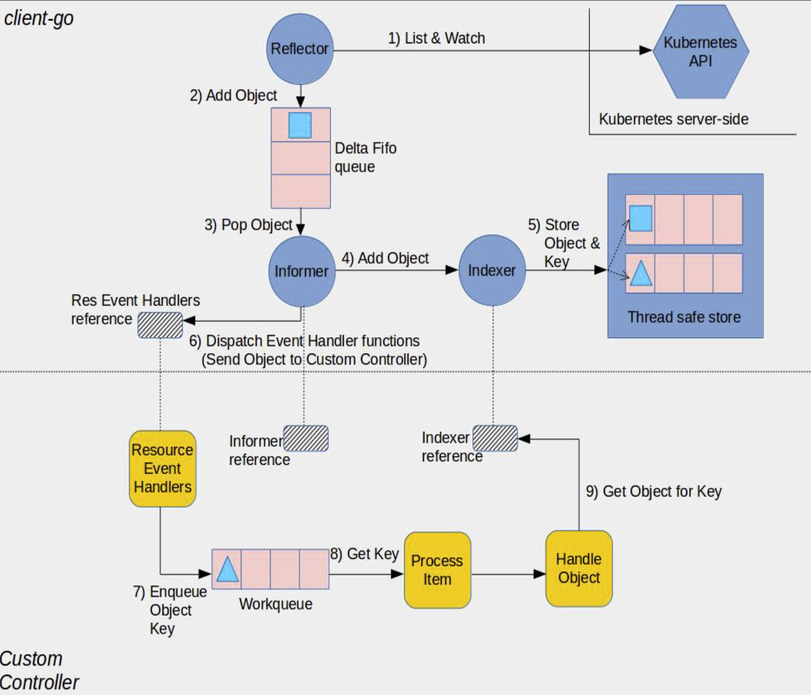

## 步骤
1. 创建自定义API对象（Custom Resource Definition），名为Student；
2. 用代码生成工具生成clientset, informers, listers相关代码；
3. 创建并运行自定义控制器，k8s环境中所有Student相关的"增、删、改"操作都会被此控制器监听到，可以根据实际需求在控制器中编写业务代码；

## 步骤一: 创建CRD

### 创建CRD

定义CRD的[student.yaml](crd/student.yaml).定义好CRD后，便可在k8s环境中执行以下命令创建CR.
```
kubectl apply -f crd/student.yaml
```

## 步骤二： 自动生成代码

### Why controller?

controller的作用就是监听指定对象的新增、删除、修改等变化，针对这些变化做出相应的响应（例如新增pod的响应为创建docker容器），关于controller的详细设计，参考下图。



[client-go under the hood](https://github.com/kubernetes/sample-controller/blob/master/docs/controller-client-go.md) 对client-go components与custom controller components的交互给出了详细说明，如下图。



### 自动生成代码是什么

简单来说， 利用自动代码生成工具可以将controller之外的事情都做好，我们只要专注于controller的开发就好。

### 实战

#### 创建CRD资源需要的定义文件

* 执行如下命令创建三层目录：
```
mkdir -p pkg/apis/bolingcavalry
```

* 在新建的bolingcavalry目录下创建文件register.go，内容如下：
```
package bolingcavalry

const (
	GroupName = "bolingcavalry.k8s.io"
	Version   = "v1"
)
```

* 在新建的bolingcavalry目录下创建名为v1的文件夹，然后在v1文件夹下创建文件doc.go，内容如下：
```
// +k8s:deepcopy-gen=package

// +groupName=bolingcavalry.k8s.io
package v1
```

上述代码中的两行注释，都是代码生成工具会用到的，一个是声明为整个v1包下的类型定义生成DeepCopy方法，另一个声明了这个包对应的API的组名，和CRD中的组名一致；

* 在v1文件夹下创建文件types.go，里面定义了Student对象的具体内容：
```
package v1

import (
	metav1 "k8s.io/apimachinery/pkg/apis/meta/v1"
)

// +genclient
// +genclient:noStatus
// +k8s:deepcopy-gen:interfaces=k8s.io/apimachinery/pkg/runtime.Object

type Student struct {
	metav1.TypeMeta   `json:",inline"`
	metav1.ObjectMeta `json:"metadata,omitempty"`
	Spec              StudentSpec `json:"spec"`
}

type StudentSpec struct {
	name   string `json:"name"`
	school string `json:"school"`
}

// +k8s:deepcopy-gen:interfaces=k8s.io/apimachinery/pkg/runtime.Object

// StudentList is a list of Student resources
type StudentList struct {
	metav1.TypeMeta `json:",inline"`
	metav1.ListMeta `json:"metadata"`

	Items []Student `json:"items"`
}
```

从上述源码可见，Student对象的内容已经被设定好，主要有name和school这两个字段，表示学生的名字和所在学校，因此创建Student对象的时候内容就要和这里匹配了；

* 在v1目录下创建register.go文件，此文件的作用是通过addKnownTypes方法使得client可以知道Student类型的API对象：
```
package v1

import (
	metav1 "k8s.io/apimachinery/pkg/apis/meta/v1"
	"k8s.io/apimachinery/pkg/runtime"
	"k8s.io/apimachinery/pkg/runtime/schema"

	"k8s_customize_controller/pkg/apis/bolingcavalry"
)

var SchemeGroupVersion = schema.GroupVersion{
	Group:   bolingcavalry.GroupName,
	Version: bolingcavalry.Version,
}

var (
	SchemeBuilder = runtime.NewSchemeBuilder(addKnownTypes)
	AddToScheme   = SchemeBuilder.AddToScheme
)

func Resource(resource string) schema.GroupResource {
	return SchemeGroupVersion.WithResource(resource).GroupResource()
}

func Kind(kind string) schema.GroupKind {
	return SchemeGroupVersion.WithKind(kind).GroupKind()
}

func addKnownTypes(scheme *runtime.Scheme) error {
	scheme.AddKnownTypes(
		SchemeGroupVersion,
		&Student{},
		&StudentList{},
	)

	// register the type in the scheme
	metav1.AddToGroupVersion(scheme, SchemeGroupVersion)
	return nil
}
```

* 至此，为自动生成代码做的准备工作已经完成了, pkg目录下的文件和目录结构是这样的：
```
pkg
└── apis
    └── bolingcavalry
        ├── register.go
        └── v1
            ├── doc.go
            ├── register.go
            └── types.go

3 directories, 4 files
```

#### 创建一个go mod工程

目录结构如下图所示，其中hack目录复制自k8s的官方[demo](https://github.com/kubernetes/sample-controller/tree/master/hack)
```
.
├── crd
│   ├── student-demo.yaml
│   └── student.yaml
├── go.mod
├── go.sum
├── hack
│   ├── boilerplate.go.txt
│   ├── custom-boilerplate.go.txt
│   ├── tools.go
│   ├── update-codegen.sh
│   └── verify-codegen.sh
└── pkg
    └── apis
        └── bolingcavalry
            ├── register.go
            └── v1
                ├── doc.go
                ├── register.go
                └── types.go
```

#### 运行code-generator

* 因为我们使用了mod，所以在工程目录下先执行`go mod vendor`，生成对应的vendor目录(vendor目录仅用于生成代码，代码生成后可删除vendor目录，也可保留)。
```
.
├── crd
├── go.mod
├── go.sum
├── hack
├── pkg
└── vendor   // 通过 go mod vendor 生成
```

* 修改 [hack/update-codegen.sh](hack/update-codegen.sh) 文件，主要是修改生成代码的位置和版本

* 在工程的根目录下运行 `./hack/update-codegen.sh`，正常运行得到以下输出：
```
脚本目录: ./hack/..
path : ./vendor/k8s.io/code-generator
Generating deepcopy funcs
Generating clientset for bolingcavalry:v1 at operator-demo-with-code-generator/pkg/generated/clientset
Generating listers for bolingcavalry:v1 at operator-demo-with-code-generator/pkg/generated/listers
Generating informers for bolingcavalry:v1 at operator-demo-with-code-generator/pkg/generated/informers
```

此时，pkg目录多了很多内容：
```
pkg
├── apis
│   └── bolingcavalry
│       ├── register.go
│       └── v1
│           ├── doc.go
│           ├── register.go
│           ├── types.go
│           └── zz_generated.deepcopy.go
└── client
    ├── clientset
    │   └── versioned
    │       ├── clientset.go
    │       ├── doc.go
    │       ├── fake
    │       │   ├── clientset_generated.go
    │       │   ├── doc.go
    │       │   └── register.go
    │       ├── scheme
    │       │   ├── doc.go
    │       │   └── register.go
    │       └── typed
    │           └── bolingcavalry
    │               └── v1
    │                   ├── bolingcavalry_client.go
    │                   ├── doc.go
    │                   ├── fake
    │                   │   ├── doc.go
    │                   │   ├── fake_bolingcavalry_client.go
    │                   │   └── fake_student.go
    │                   ├── generated_expansion.go
    │                   └── student.go
    ├── informers
    │   └── externalversions
    │       ├── bolingcavalry
    │       │   ├── interface.go
    │       │   └── v1
    │       │       ├── interface.go
    │       │       └── student.go
    │       ├── factory.go
    │       ├── generic.go
    │       └── internalinterfaces
    │           └── factory_interfaces.go
    └── listers
        └── bolingcavalry
            └── v1
                ├── expansion_generated.go
                └── student.go

20 directories, 27 files
```

如上所示，zz_generated.deepcopy.go就是DeepCopy代码文件，client目录下的内容都是客户端相关代码，在开发controller时会用到；
client目录下的clientset、informers、listers的身份和作用可以和前面的图结合来理解

## 步骤三： 创建自定义controller

* 在operator-demo-with-code-generator目录下创建[controller.go](controller.go)

该有以下几处关键点：
a. 创建controller的NewController方法中，定义了收到Student对象的增删改消息时的具体处理逻辑，除了同步本地缓存，就是将该对象的key放入消息中；
b. 实际处理消息的方法是syncHandler，这里面可以添加实际的业务代码，来响应Student对象的增删改情况，达到业务目的；

* 在operator-demo-with-code-generator/pkg目录下创建处理系统信号量的辅助类，在main.go中会用到（处理例如ctrl+c的退出）。signals目录复制自k8s的官方[demo](https://github.com/kubernetes/sample-controller/tree/master/pkg/signals)

* 在operator-demo-with-code-generator目录下创建[main.go](main.go)文件

* 在工程的根目录下运行`go build`，生成operator-demo-with-code-generator的二进制可执行文件

* 在k8s环境中，执行命令./k8s_customize_controller -kubeconfig=$HOME/.kube/config -alsologtostderr=true，会立即启动controller，看到控制台输出如下：
```
I0505 16:55:49.473096    2675 controller.go:72] Setting up event handlers
I0505 16:55:49.473978    2675 controller.go:96] 开始controller业务，开始一次缓存数据同步
I0505 16:55:49.574270    2675 controller.go:101] worker启动
I0505 16:55:49.574351    2675 controller.go:106] worker已经启动
```

* 验证controller

在new-student.yaml所在目录执行命令kubectl apply -f new-student.yaml；
返回controller所在的控制台窗口，发现新输出了如下内容，可见新增student对象的事件已经被controller监听并处理：
```
I0505 16:57:38.017552    4462 controller.go:181] 这里是student对象的期望状态: &v1.Student{TypeMeta:v1.TypeMeta{Kind:"", APIVersion:""}, ObjectMeta:v1.ObjectMeta{Name:"object-student", GenerateName:"", Namespace:"default", SelfLink:"/apis/bolingcavalry.k8s.io/v1/namespaces/default/students/object-student", UID:"7288e16d-0ea2-4fa5-a4b2-77530051cdab", ResourceVersion:"19566140", Generation:1, CreationTimestamp:v1.Time{Time:time.Time{wall:0x0, ext:63755801858, loc:(*time.Location)(0x22d2b80)}}, DeletionTimestamp:(*v1.Time)(nil), DeletionGracePeriodSeconds:(*int64)(nil), Labels:map[string]string(nil), Annotations:map[string]string{"kubectl.kubernetes.io/last-applied-configuration":"{\"apiVersion\":\"bolingcavalry.k8s.io/v1\",\"kind\":\"Student\",\"metadata\":{\"annotations\":{},\"name\":\"object-student\",\"namespace\":\"default\"},\"spec\":{\"name\":\"张三\",\"school\":\"深圳中学\"}}\n"}, OwnerReferences:[]v1.OwnerReference(nil), Finalizers:[]string(nil), ClusterName:"", ManagedFields:[]v1.ManagedFieldsEntry(nil)}, Spec:v1.StudentSpec{name:"", school:""}} ...
I0505 16:57:38.017785    4462 controller.go:182] 实际状态是从业务层面得到的，此处应该去的实际状态，与期望状态做对比，并根据差异做出响应(新增或者删除)
I0505 16:57:38.017881    4462 controller.go:145] Successfully synced 'default/object-student'
I0505 16:57:38.017978    4462 event.go:282] Event(v1.ObjectReference{Kind:"Student", Namespace:"default", Name:"object-student", UID:"7288e16d-0ea2-4fa5-a4b2-77530051cdab", APIVersion:"bolingcavalry.k8s.io/v1", ResourceVersion:"19566140", FieldPath:""}): type: 'Normal' reason: 'Synced' Student synced successfully
```

尝试修改和删除已有的Student对象，观察controller控制台的输出，确定是否已经监听到所有student变化的事件，例如删除的事件日志如下：
```
I0505 16:58:34.818900    4462 controller.go:171] Student对象被删除，请在这里执行实际的删除业务: default/object-student ...
I0505 16:58:34.818998    4462 controller.go:145] Successfully synced 'default/object-student'
```

## 参考
* [文档](https://blog.csdn.net/boling_cavalry/article/details/88917818)
* [使用code generator生成kubernetes的crd代码](https://www.g5niusx.com/2020/03/kubernetes-1.html)
* [代码](https://github.com/zq2599/blog_demos/tree/master/k8s_customize_controller)
