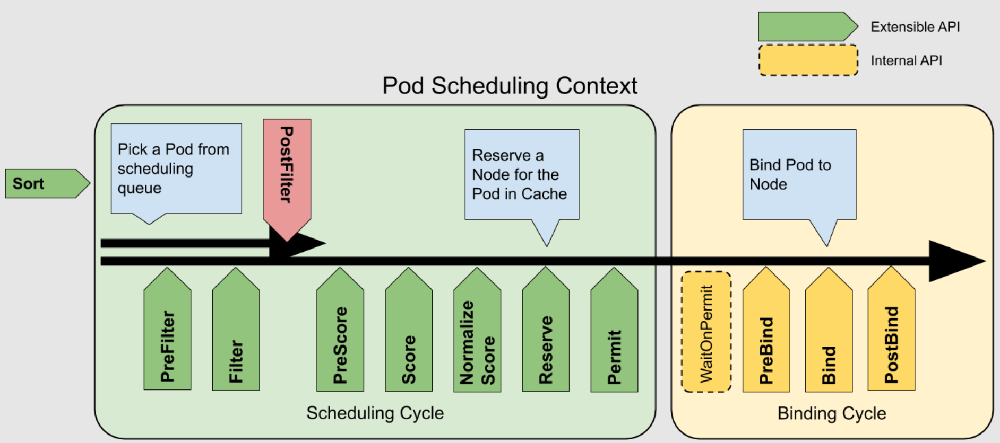

# K8S调度器

kube-scheduler是kubernetes的调度器，它的主要作用就是根据特定的调度算法和调度策略将Pod调度到合适的Node节点上去，是一个独立的二进制程序，
kube-scheduler利用API服务器的监听机制（结合informer机制，通过informer机制可以很容易监控我们所关心的资源事件）,启动之后会一直监听API Server
获取到PodSpec.NodeName为空的Pod，对每个Pod都会创建一个binding.简而言之，调度器就是给pod分配节点。

## 内置调度算法步骤

调度主要分为以下几部分：
- 首先是预选过程，过滤掉不满足条件的节点，这个过程称为Predicates(filter)。
  - 具体而言，检查节点是否符合运行“待调度pod资源对象“的条件，如果符合条件，则将其加入可用节点列表。
- 然后是优选过程，对通过的节点按照优先级排序，称之为Priorities(score)。
  - 具体而言，为每个可用节点计算出一个最终分数，kube-scheduler调度器会将分数最高的节点作为最优运行“待调度pod资源对象”的节点。
- 最后从中选择优先级最高的节点，如果中间任何一步骤有错误，就直接返回错误。
  - Pod资源对象支持优先级(Priority)与抢占(Preempt)机制。当kube-scheduler调度器运行时，高优先级的pod资源对象排在调度队列（schedulingqueue）的前面，
  优先获得合适的节点(node)。当高优先级的Pod资源对象没有合适的节点时，调度器会尝试抢占低优先级的Pod资源对象的节点。K8s中存在PriorityClass资源，即优先等级资源。为pod设置优先级，可在PodSpec中添加优先级对象名称。

## 亲和性调度

Kube-scheduler调度器自动为Pod资源对象选择全局最优或局部最优节点（即节点的硬件资源足够多、节点负载足够小等）。
在生产环境中，一般希望能够更多地干预、控制Pod资源对象的调度策略。例如，将需要GPU硬件资源的pod资源对象分配给具有GPU硬件资源的节点，或者如果两个业务联系紧密，
则可以将它们调度到同一个节点上，以减少因网络传输而带来的性能损耗等问题。

- 亲和性（Affinity）：用于多业务就近部署，例如允许将两个业务的pod资源对象尽可能的调度到同一个节点上。
- 反亲和性（Anti-Affinity）：允许将一个业务的pod资源对象的多副本实例调度到不同的节点上，以实现高可用性。

Pod资源对象目前支持两种亲和性和一种[反亲和性](https://github.com/kubernetes/kubernetes/blob/master/staging/src/k8s.io/api/core/v1/types.go#L2716):
- NodeAffinity：pod资源对象与节点之间的关系亲和性；
- PodAffinity：pod与pod的关系亲和性；
- PodAntiAffinity：pod与pod的关系反亲和性；

## kube-scheduler调度扩展的四种方式

Kube-scheduler调度扩展的[四种选择](https://blog.csdn.net/ll837448792/article/details/93619549):

- 将新的调度算法添加到默认调度程序中，并重新编译镜像，最终该镜像运行的实例作为kubernetes集群调度器；
- 参考kube-scheduler实现满足自己业务场景的调度程序，并编译镜像，将该程序作为独立的调度器运行到kubernetes集群内，需要用该调度器调度的pod实例，在spec.schedulerName里指定该调度器；
- 实现“调度扩展程序“：默认调度器kube-scheduler在进行预选时会调用该扩展程序进行过滤节点；在优选时会调用该扩展程序进行给节点打分，或者在bind操作时，调用该扩展器进行bind操作。
- K8s scheduling framework（补充，k8s v1.16才有的特性）。通过调度框架（Scheduling Framework），Kubernetes v1.15 版本中引入了可插拔架构的调度框架，
使得定制调度器这个任务变得更加的容易。调库框架向现有的调度器中添加了一组插件化的 API，该 API 在保持调度程序“核心”简单且易于维护的同时，使得大部分的调度功能以插件的形式存在，
而且在我们现在的 v1.16 版本中上面的 调度器扩展程序 也已经被废弃了，所以以后调度框架才是自定义调度器的[核心方式](https://www.kubernetes.org.cn/7983.html). 

对上述方式进行评估：
- 第一种：将自己的调度算法添加到默认调度器kube-scheduler中，对原生代码侵入性较高，而且随着kubernetes版本升级，维护成本也较高；
- 第二种：默认调度器里内置了很多优秀调度算法，如：检查节点资源是否充足；端口是否占用；volume是否被其他pod挂载；亲和性；均衡节点资源利用等，如果完全使用自己开发的调度器程序，可能在达到了实际场景调度需求同时，失去更佳的调度方案，除非集成默认调度器中的算法到自己独立调度程序中，但这无疑是不现实的；另外，当多个调度器将Pod调度到同一个节点的时候，很有可能两个调度器都同时将两个 Pod 调度到同一个节点上去，但是很有可能其中一个 Pod 运行后其实资源就消耗完了。
- 第三种：通过启动参数的policy配置，选用某些默认调度器中的预选、优选调度算法的同时，也可以调用外部扩展调度程序的算法，计算得到最优的调度节点，无需修改kube-scheduler代码，只需要在启动参数中增加配置文件即可将默认调度程序和扩展调度程序相互关联。[参考](https://github.com/kubernetes/community/blob/master/contributors/design-proposals/scheduling/scheduler_extender.md)

kube-scheduler在调度pod实例时，首先获取到Node1、Node2、Node3三个节点信息，进行默认的预选阶段，筛选满足要求的节点，其次再调用扩展程序中的预选算法，选出剩下的节点，假设预选阶段Node3上资源不足被过滤掉，预选结束后只剩Node1和Node2；Node1和Node2进入kube-scheduler默认的优选阶段进行节点打分，其次再调用扩展调度程序中的优选算法进行打分，kube-scheduler会将所有算法的打分结果进行加权求和，获得分数最高的节点作为pod最终bind节点，然后kube-scheduler调用apiserver进行bind操作。（上图的总分计算可能有误）。
但是，extender存在以下问题（见下图）：
- 调用 Extender 的接口是 HTTP 请求，受到网络环境的影响，性能远低于本地的函数调用。同时每次调用都需要将 Pod 和 Node 的信息进行 marshaling 和 unmarshalling 的操作，会进一步降低性能；
- 用户可以扩展的点比较有限，位置比较固定，无法支持灵活的扩展，例如只能在执行完默认的 Filter 策略后才能调用。

基于以上介绍，Extender 的方式在集群规模较小，调度效率要求不高的情况下，是一个灵活可用的扩展方案，但是在正常生产环境的大型集群中，Extender 无法支持高吞吐量，性能较差。

### 参考

- [extender介绍博客](https://blog.51cto.com/u_15077560/2584702)
- [extender应用实例](https://github.com/AliyunContainerService/gpushare-scheduler-extender/blob/master/docs/install.md)

## k8s scheduling framework

Scheduling Framework 在原有的调度流程中, 定义了丰富扩展点接口，开发者可以通过实现扩展点所定义的接口来实现插件，将插件注册到扩展点。
Scheduling Framework 在执行调度流程时，运行到相应的扩展点时，会调用用户注册的插件，影响调度决策的结果。通过这种方式来将用户的调度逻辑集成到 
Scheduling Framework 中。

扩展的调用顺序如下：
- 如果某个扩展点没有配置对应的扩展，调度框架将使用默认插件中的扩展
- 如果为某个扩展点配置且激活了扩展，则调度框架将先调用默认插件的扩展，再调用配置中的扩展
- 默认插件的扩展始终被最先调用，然后按照 KubeSchedulerConfiguration 中扩展的激活 enabled 顺序逐个调用扩展点的扩展
- 可以先禁用默认插件的扩展，然后在 enabled 列表中的某个位置激活默认插件的扩展，这种做法可以改变默认插件的扩展被调用时的顺序

### 参考

- [官方文档对扩展点的说明1](https://github.com/kubernetes/enhancements/tree/master/keps/sig-scheduling/624-scheduling-framework)
- [官方文档对扩展点的说明2](https://kubernetes.io/zh/docs/concepts/scheduling-eviction/scheduling-framework/)
- [k8s默认启动的插件示例](https://kubernetes.io/zh/docs/reference/scheduling/config/)

